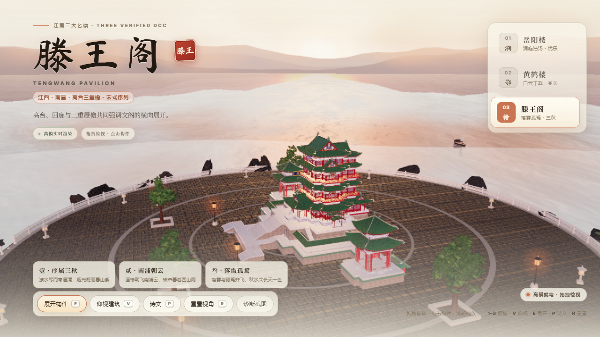
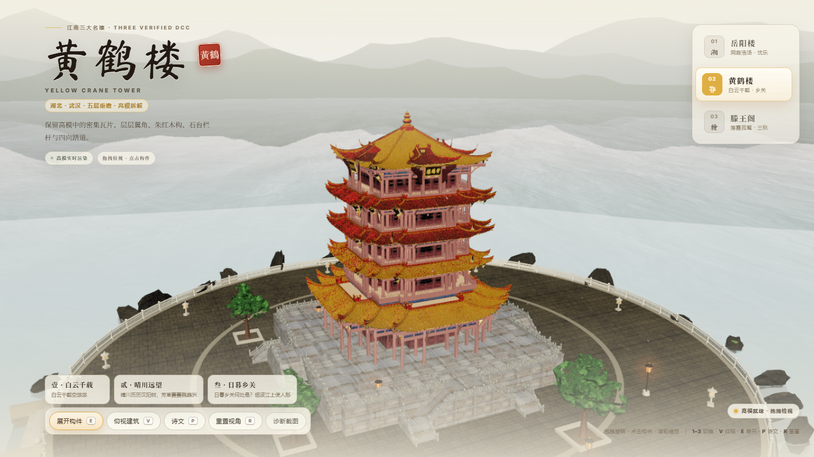

# 中国楼阁 · 高模 3D 藏品

Three.js 中国楼阁高精度三维展示项目，包含岳阳楼、黄鹤楼、滕王阁三座经 DCC 高模解析的楼阁，以楼阁对应诗文为主叙事。

## 预览






## 快速开始

```bash
# 安装依赖
pnpm install

# 拉取运行时 3D 资产（约 350MB，Release 一键下载 + SHA-256 校验，详见 docs/ASSETS.md）
pnpm assets

# 开发服务器
pnpm dev

# 生产构建
pnpm build

# 构建产物预览
pnpm preview
```

没跑 `pnpm assets` 也能启动：缺失 GLB 的楼阁会进入明确的降级模式（见 `src/runtime/loadVerifiedGlb.ts`）。

Windows 下也可直接双击 `start-preview.cmd` 一键启动开发预览。

## 部署成品

```bash
pnpm deploy                 # 构建 + 归档裁剪 + 契约校验，输出部署清单与缓存配置
DEPLOY_BASE=/towers/ pnpm deploy   # 子路径部署（首尾斜杠都要有）
```

把 `dist/` 整体搬到站点对应路径即可，JS/CSS 引用与运行时 `/assets` 拉取自动收敛到同一基座。详见 [docs/RELEASE.md](docs/RELEASE.md)。

## 项目结构

```
├── index.html              # 应用入口
├── package.json            # 项目配置
├── tsconfig.json           # TypeScript 配置
├── vite.config.ts          # Vite 构建配置
├── pnpm-lock.yaml          # 依赖锁定
├── pnpm-workspace.yaml     # 工作区配置
├── start-preview.cmd       # Windows 快速启动脚本
│
├── src/                    # 源代码
│   ├── main.ts             # 应用入口 & 场景初始化
│   ├── style.css           # 全局样式
│   ├── content/pavilionContent.ts          # 楼阁诗文内容
│   ├── createYueyangTowerNativeModel.ts    # 岳阳楼手写模型
│   ├── createYueyangTowerStructuralModel.ts # 岳阳楼结构模型
│   ├── createTengwangTowerHighModel.ts     # 滕王阁高精度 GLB 集成
│   ├── createHuangheTowerHighModel.ts      # 黄鹤楼高精度 GLB 集成
│   ├── createPavilionGalleryModel.ts       # 楼阁画廊 & 规格定义
│   ├── createTengwangProceduralTextures.ts # 滕王阁程序化纹理
│   ├── runtime/            # 运行时模块（质量分档、GLB 校验加载、后处理、水面、 godrays、诗文卡等）
│   └── vendor/             # meshopt 简化器
│
├── public/                 # 静态资源
│   ├── favicon.svg
│   └── assets/             # HDRI、draco 解码器、瓦片纹理、资产清单（随 git 分发）
│                           # 大体积运行时 GLB 不进 git，由 GitHub Release 分发（pnpm assets 拉取）
│
├── scripts/                # 成品链路脚本
│   ├── fetch-assets.mjs    #   pnpm assets —— 从 Release 拉资产并校验
│   ├── package-asset-pack.mjs # 维护者打包资产包
│   ├── deploy-static.mjs   #   pnpm deploy —— 构建 + 部署输出
│   ├── build-final-html.mjs / verify-final-html.mjs # dist 裁剪与契约校验
│   └── shot-screenshots.mjs #  pnpm screenshots —— README 预览图
│
└── docs/                   # 项目文档
    ├── ASSETS.md           # 资产分级与分发策略
    ├── RELEASE.md          # 部署说明与质量/调试参数
    └── screenshots/        # 预览图
```

## 楼阁说明

| 楼阁 | 模型类型 | 状态 |
|------|---------|------|
| 岳阳楼 | 程序化结构模型 | ✅ 完成 |
| 黄鹤楼 | 高精度 GLB | ✅ 完成 |
| 滕王阁 | 高精度 GLB（hero 档另有大师级烘焙版） | ✅ 完成 |

三座楼阁的运行时 GLB（各 LOD 档 + 环境 + 配景）统一由 Release 资产包分发，SHA-256 校验后解压到 `public/assets/`。

## 技术栈

- **渲染引擎**: Three.js r160+
- **构建工具**: Vite 7 + TypeScript
- **包管理器**: pnpm
- **后处理**: EffectComposer / UnrealBloomPass / BokehPass

## 质量与调试参数

- 默认：设备检测自动选择 Standard 或 Mobile；`?quality=hero|standard|mobile` 可强制档位（hero 加载滕王阁大师版烘焙 GLB）。
- `?pavilion=yueyang|huanghe|tengwang` — 直接打开指定楼阁
- `?view=front|three-quarter|...|low-angle` — 固定审查视角
- `?lod=lod0|lod1|lod2` — 强制 LOD 档（受控审查用）
- `?noshadow=1` / `?nobloom=1` — 关闭阴影 / 泛光（诊断用）
- `?hideglb=1` — 隐藏 GLB 模型（诊断用）
- `?noadapt=1` — 关闭运行时自适应降载

## License

MIT，见 [LICENSE](LICENSE)。
