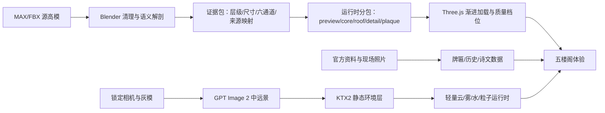

# 中国五座名楼 Three.js 高保真重建完整落地方案 V3

版本：3.0  
日期：2026-08-15  
状态：执行基线（本文件完成的是落地规划，尚未代表模型修复已完成）  
适用项目：`E:\Station\China_Tower`  
替代关系：本文件替代 `docs/engineering-implementation-v2.md` 作为后续执行依据；V2 保留为历史记录。

---

## 0. 决策摘要

本轮不再继续用少量材质合并网格“硬撑”视觉效果，也不以程序化研究模型代替源高模。最终产品只保留五座楼阁：

1. 岳阳楼
2. 黄鹤楼
3. 滕王阁
4. 飞云楼
5. 蓬莱阁

鹳雀楼从导航、数据、查询参数、测试和发布说明中移除。通用程序化楼阁工厂只作为五座高模加载失败时的明确降级视图，不再作为第六座展品。

主路线调整为：

```text
3D资产中的 MAX 高模
  -> 隔离转换与哈希核验
  -> Blender 5.2 重新解剖、清理、语义分组
  -> 屋顶/主体/细节/牌匾分包
  -> 三档 LOD 与实例化
  -> Three.js 渐进加载
  -> 多角度、多通道、性能和内容验收
```

环境路线采用“真实近景 3D + GPT Image 2 中远景分层图 + Three.js 轻量动态”的混合方案。禁止使用 GIF，禁止让生成图替代建筑模型，禁止将普通 LDR 生成图当作 HDR 环境光照。

实施优先级固定为：

```text
飞云楼 -> 蓬莱阁 -> 黄鹤楼 -> 滕王阁 -> 岳阳楼精修
```

原因是前四者分别存在严重的语义合并、围护结构丢失、屋面细节压平和场景离群物问题；岳阳楼当前相对完整，适合作为最后的统一品质标杆。

---

## 1. 项目目标与完成定义

### 1.1 最终目标

交付一个通过 HTTP 访问、可在桌面和移动浏览器运行的五楼阁 Three.js 展示项目，满足：

- 五座楼阁均以 `3D资产` 中对应高模为第一几何证据，经 Blender/3ds Max 解剖后重建运行时资产。
- 建筑不是“单坨网格”：基础、台基、柱梁、斗拱、门窗、栏杆、屋面、瓦作、脊饰、牌匾等可追溯、可选中、可拆解。
- 每座楼的关键识别特征在正面、左右、背面、三分之四和俯视角均成立。
- 相机支持从接近人眼高度仰视建筑，可查看檐下、斗拱、牌匾和屋顶层次，同时不会穿入地面或建筑。
- 牌匾位置、朝向、文字、字形来源和材质有证据；无可靠依据时明确标为近似，不臆造书家或字体。
- 每座楼有真实简明介绍、建筑特征、牌匾说明和相关古诗文赏析，并保留来源。
- 每座楼有与所在地相符的静态环境和低成本动态效果；关闭动画时画面仍然完整。
- 首屏先出现轻量预览，再增量加载主体、屋面和细节；切换楼阁不会同时下载全部资产。
- 加载失败、弱设备、节流模式和 `prefers-reduced-motion` 均有可用降级路径。

### 1.2 不在本轮范围内

- 不恢复或宣称复原某一已经失传的历史年代形制，除非有明确测绘或修缮图纸。
- 不把源 MAX/FBX 文件直接发到浏览器。
- 不把 AI 生成图中的建筑、文字或牌匾当作建筑史证据。
- 不追求室内漫游、人物系统、物理破坏或 VR。
- 不把 `file://` 双击打开作为正式运行方式；开发和交付均通过 HTTP 服务。

### 1.3 “完成”不等于“能加载”

单个 GLB 成功显示只代表传输成功。每座楼只有同时通过以下条件才可标记为完成：

- 源高模语义覆盖通过；
- 关键构件覆盖通过；
- 多角度轮廓通过；
- 屋面、瓦作、斗拱、台基和牌匾近景通过；
- 材质与光照通过；
- 点击、拆解和资源释放通过；
- 桌面和移动加载预算通过；
- 历史内容与来源审查通过。

---

## 2. 当前工程基线与根因

### 2.1 已有能力

当前项目已有：

- 5 个 MAX 源资产的哈希、隔离转换产物和 Blender 5.2 分析证据；
- 每座楼 3 档 GLB；
- 验证式 GLB 加载、取消旧请求、进度、失败降级；
- Hero / Standard / Mobile 三档画质；
- ACES、sRGB、PMREM、主光/辅光/轮廓光、地面阴影；
- 统一选中、强调、拆解、复位运行时；
- 目录部署产物和基础烟雾测试。

现有正式入口必须通过 `npm run dev`、`npm run preview` 或部署 `dist` 目录访问。直接双击 `index.html` 会受到 ES Module、绝对资源路径和浏览器安全策略限制，不属于支持路径。

### 2.2 源资产与运行时压缩现状

| 楼阁 | Blender 源场景 | 源三角面 | 当前 LOD0 | 当前 LOD1 | 当前 LOD2 | 主要问题 |
| --- | ---: | ---: | ---: | ---: | ---: | --- |
| 岳阳楼 | 437 对象 / 88 网格 / 12 材质 | 1,744,808 | 311 网格 / 494,282 面 / 23.15 MiB | 324 / 417,940 / 8.72 MiB | 324 / 389,904 / 8.31 MiB | 相对完整，但 713 次绘制过高；瓦作、斗拱、牌匾与材质仍需统一精修 |
| 黄鹤楼 | 1,592 对象 / 243 网格 / 13 材质 | 3,420,122 | 11 / 3,420,110 / 89.05 MiB | 11 / 1,710,333 / 44.74 MiB | 11 / 1,026,692 / 27.62 MiB | 保住了体量和底座，却把 243 个语义网格压成 11 个；屋瓦与层级不可读，体积过大 |
| 滕王阁 | 260 对象 / 232 网格 / 105 材质 | 5,157,859 | 13 / 137,047 / 16.64 MiB | 13 / 95,991 / 2.85 MiB | 13 / 55,347 / 1.66 MiB | 场景包围盒达 4,642 m，存在离群物；主体抽取和减面过度，关键结构证据不足 |
| 飞云楼 | 旧盘点 35 对象 / 31 网格；V3 核验 30 个源建筑网格 | 2,540,987 | 3 / 2,540,987 / 93.80 MiB | 3 / 1,270,477 / 41.49 MiB | 3 / 762,280 / 27.06 MiB | 30 个源建筑网格被合并成 3 个材质网格，语义、层次和颜色一起塌缩；旧盘点多出的 1 网格/12 面来自 Blender 默认 Cube |
| 蓬莱阁 | 9,069 对象 / 9,066 网格 / 85 材质 | 4,059,811 | 30 / 757,336 / 34.73 MiB | 30 / 416,982 / 18.01 MiB | 30 / 229,910 / 11.17 MiB | 9,066 个源网格压成 30 个；门窗、墙体等围护构件丢失或被误筛，只剩“镂空框架” |

当前三档全部资产总量约 257.38 MiB。这个数字不是首屏下载量，但说明继续沿用“每座楼一个大 GLB”的结构无法同时解决细节和加载速度。

### 2.3 当前 Standard 运行时信号

| 楼阁 | 绘制次数 | 三角面 | 稳定部件数 | 诊断 |
| --- | ---: | ---: | ---: | --- |
| 岳阳楼 | 713 | 421,435 | 715 | 语义较好但调用碎片化，必须渲染批处理与交互代理分离 |
| 黄鹤楼 | 12 | 1,710,429 | 11 | 绘制少是因为过度合并，不代表结构好；面数和下载都超预算 |
| 滕王阁 | 14 | 96,087 | 13 | 过轻，已牺牲身份细节 |
| 飞云楼 | 4 | 1,270,573 | 3 | 典型“高面数但低信息量” |
| 蓬莱阁 | 31 | 417,078 | 30 | 体量尚可，但语义筛选漏掉围护结构 |

现有性能审计是静态可复现信号，不等于真实跨设备 FPS 认证。V3 必须加入受控硬件/浏览器实测。

### 2.4 旧质量轨道状态

`.img2threejs/state.json` 当前为：

```text
status=stopped
pass=form-refinement
loop=3/3
reason=max-correction-loops-reached
```

处理原则：

- 不修改该状态来绕过停止门禁；
- 旧岳阳楼程序化尝试作为历史证据保留；
- 五座 DCC 高模修复分别建立新 job/state，不共用旧循环计数；
- 新轨道的“继续”必须由新证据和新验收决定，不能从聊天记录推定。

---

## 3. 目标工程架构



### 3.1 目录落地目标

```text
docs/
  engineering-implementation-v3.md
  source-register.md
  plaque-evidence-register.md

evidence/v3/<pavilion-id>/
  source/
  dissection/
  renders/
    front/
    three-quarter/
    right/
    rear/
    left/
    elevated/
    closeups/
  reviews/
  performance/

pipeline/blender/v3/
  audit_scene.py
  clean_scene.py
  build_semantic_hierarchy.py
  export_runtime_packs.py
  render_review_passes.py

src/content/
  pavilionContent.ts
  contentSources.ts

src/pavilions/
  manifest.ts
  loaders/
  runtimeTypes.ts

src/runtime/
  PavilionStreamingRuntime.ts
  PavilionPickingProxy.ts
  SceneEnvironmentRuntime.ts
  ResourceLifetime.ts

public/assets/pavilions/<pavilion-id>/
  <hash>.preview.glb
  <hash>.core.lod1.glb
  <hash>.roof.lod1.glb
  <hash>.detail.lod1.glb
  <hash>.plaque.lod1.glb
  <hash>.hero.*.glb
  asset-manifest.json

public/assets/scenes/<pavilion-id>/
  panorama-desktop.ktx2
  panorama-mobile.ktx2
  midground.webp
  motion-noise.ktx2
  scene.json
  provenance.json
```

旧文件在新资产验收前保留；替换采用 manifest 指针切换，不覆盖可工作的旧 GLB，以便回滚。

---

## 4. 工作流 A：移除鹳雀楼并收紧产品范围

### A1. 数据与界面

- 从 `index.html` 移除鹳雀楼卡片和文案。
- 从 `PAVILION_SPECS`、`PavilionId` 和默认路由中移除 `guanque`。
- `?pavilion=` 只接受五个正式 ID；非法或旧的 `guanque` 回退到岳阳楼，并给出非阻塞提示。
- 删除快捷键 6 及相关可访问性文案。

### A2. 运行时与降级

- 保留 `createPavilionStudyModel` 作为明确标注的通用失败降级工厂。
- 降级模型不出现在导航中，不显示为“高模已加载”。
- 降级状态必须设置 `assetState=degraded`、可见错误说明和失败原因。

### A3. 测试与发布

- 所有数量断言从 6 改为 5。
- 更新 URL 参数测试、导航测试、可访问性测试和发布说明。
- 重新生成 `dist`，确认发布清单中没有鹳雀楼展示入口或资源。

退出标准：应用中无任何可进入的鹳雀楼展品；通用降级能力仍可被五座楼的失败测试调用。

---

## 5. 工作流 B：五座高模的 DCC 重新解剖

### 5.1 每座楼统一语义树

每座楼都必须输出以下层级；没有的构件应显式标为 `not-present`，不能静默缺失：

```text
building
  foundation
  podium
  structural-frame
    columns
    beams
    brackets-dougong
  facade
    walls
    doors-windows
    railings
  roof-system
    rafters
    sheathing
    tiles
    eaves
    ridges
    ornaments-finial
  plaques
  secondary-details
```

每个语义节点记录：

- 源对象 ID/名称/哈希；
- Blender 对象与集合；
- 几何/材质/贴图来源；
- 变换、包围盒、三角面、实例数；
- 可见角度与置信度；
- GLB node 名称；
- Three.js 稳定部件 ID；
- LOD 保留策略；
- 是否可点击、是否参与拆解、跟随哪个父构件移动。

映射链必须可查询：

```text
source object -> Blender object -> semantic node -> GLB node -> runtime stable ID
```

### 5.2 DCC 五阶段

#### B0：源冻结与重放

- 复核 MAX 哈希、FBX 哈希、Blender 版本、转换脚本版本和贴图清单。
- 原件只读，清理在新副本中执行。
- 将当前运行时 GLB 记录为 `baseline`，不可覆盖。

#### B1：场景清理

- 统一米制、轴向、原点和正面方向。
- 清理远离主体的相机、灯光、辅助模型、隐藏残片和异常缩放。
- 对滕王阁先做离群物聚类，再决定主体集合，禁止按全场包围盒直接归一化。
- 不因材质相同就合并建筑语义；材质合批延后到运行时导出阶段。

#### B2：语义解剖

- 使用源层级、对象名、空间位置、重复变换、连通分量、法线方向和材质槽生成候选分组。
- 自动结果只叫 `hypothesis`；关键构件必须由隔离渲染复核。
- 输出总体、分层和局部构件目录，以及正/背/侧/俯视语义 ID 图。
- 台基、屋顶、牌匾和围护结构必须是硬门禁节点。

#### B3：结构修复与材质恢复

- 修复缺失墙体、门窗、栏杆、檐口、屋瓦、斗拱等运行时抽取遗漏；优先从源高模恢复，不凭空补造。
- 只对重复构件使用实例；屋面大曲面保持连续表面。
- 材质拆分为独立 albedo、roughness、normal/height、AO、metalness 通道；不允许用同一灰度图冒充所有通道。
- 建立木、石、灰泥、彩画、琉璃瓦、金属/鎏金和牌匾的材料族，但保留每座楼的局部颜色与风化差异。

#### B4：运行时分包与 LOD

- 先导出 `preview`，再导出 `core`、`roof`、`detail`、`plaque`。
- 近景识别特征的 LOD 保护权重高于不可见背面微面。
- 瓦片、斗拱、栏杆、窗格等重复件优先 GPU 实例化。
- 为渲染合批可以减少材质批次，但必须保留不可见 picking proxy 或语义索引，不能再次把交互部件压成一坨。

#### B5：证据渲染和复核

每个审查视角输出：

- beauty；
- alpha silhouette；
- semantic ID；
- depth；
- normal；
- roughness/material ID。

固定视角至少为正面、三分之四、右侧、背面、左侧、俯视、仰视；另加台基、屋顶、瓦作、斗拱和牌匾近景。先跑确定性门禁，再做人工视觉判断。

### 5.3 单次修正规则

一次循环只修一个问题组，顺序为：

```text
相机 -> 主轮廓 -> 结构比例 -> 围护与门窗 -> 屋面与瓦作 -> 斗拱/栏杆 -> 牌匾 -> 材质 -> 灯光
```

每座楼、每个阶段最多 3 次修正，单楼总计最多 6 次。达到上限时停止并记录：仍不匹配的区域、证据不足点、继续需要的新输入。不得用全局评分掩盖关键构件失败。

---

## 6. 五座楼的专项修复任务

### 6.1 飞云楼（最高优先级）

已知根因：V3 已核验的 30 个源建筑网格被按 3 个材质合并，2.54M 面没有转化成结构信息，棕色统一材质进一步抹平层次。旧盘点中的第 31 个网格是 Blender 默认 Cube，不属于源资产。

任务：

1. 从 full-scene FBX 重新建立 30 个源建筑网格的对象目录，不使用现有 3 网格 GLB 做语义真值。
2. 依据空间高度、檐层和连通分量拆出外观三层、内部暗层、柱网、梁枋、斗拱、32 个翘角和屋顶系统。
3. 复核当地官方资料所述“四根通天柱、外围 32 柱、外观三层/内部五层、345 组斗拱、32 个翘角”与源模型是否可观察一致；资料只能帮助命名和审查，不能强改源模型去凑数字。
4. 木构不再使用单一棕色：柱梁、斗拱、阴影面、风化面至少有可读的明度和粗糙度层次。
5. 台基和院落接地必须清楚，避免雾、环境色和软阴影再次把轮廓糊成一团。

专项验收：三层檐口能分读；主柱/外围柱、斗拱团、32 翘角和屋顶轮廓在近景/远景均成立；Standard 不超过 900k 面，Mobile 不超过 350k 面。

### 6.2 蓬莱阁

已知根因：9,066 个源网格被压到 30 个；按主体筛选时门窗、墙体和回廊围护丢失，产生空架感。

任务：

1. 用空间聚类先分离建筑群，再锁定蓬莱阁主体，不对 9,066 个对象逐个手工处理。
2. 通过墙面方向、厚度、窗门重复、栏杆高度和材质槽重建 `facade` 集合。
3. 对墙、门、窗、栏杆、柱网、上下层楼板和双檐屋面进行遮挡检查，修复抽取漏项。
4. 复核“二层、重檐、周围回廊、约 15 m”的公开资料与源资产可见结构；不一致处保留源模型证据并标注。
5. 建筑群背景只保留与主体构图相关的丹崖、石栏和近景地形；其他建筑按场景包延迟加载。

专项验收：从任何水平角度都不能透过整栋楼看到另一侧；门窗、墙体与回廊形成完整围护；海雾不会掩盖主体缺失。

### 6.3 黄鹤楼

已知根因：243 个源网格压成 11 个；主体体量和底座存在，但屋瓦、层级、檐口和装饰语义被材料合并抹平；Standard 1.71M 面且 44.74 MiB。

任务：

1. 重新按台基、五层主体、各层檐口、屋顶、瓦作、攒尖、门窗/栏杆、牌匾分组。
2. 单独提取筒瓦、板瓦、瓦当、滴水、正脊/垂脊和宝顶候选；验证其重复规律后改为实例系统。
3. 保护“层层飞檐、攒尖顶、金色宝顶”主识别系统，普通不可见瓦片可降级。
4. 将现有 89 MiB 大 GLB 拆包；preview 先到，屋顶和英雄细节按视距/停留时间加载。
5. 在不破坏底座的前提下重新校准主体高度、每层收分和屋面材质，避免“只剩底座清楚”。

专项验收：五层、各层檐口、瓦片方向、脊饰和宝顶在标准光照下可读；Standard 首个 core 不超过 18 MiB，完整 Standard 面数原则上不超过 900k。

### 6.4 滕王阁

已知根因：源场景 5.16M 面，包围盒约 4.6 km；当前 LOD0 只剩 137k 面，主体识别特征被过度减面。

任务：

1. 以已有 landmark candidates 和 main-tower core hypotheses 为起点，重新确定主体集合并排除远处离群物。
2. 单独保留高台、主阁、翼部/附属体、重檐歇山屋面、回廊、柱网、门窗和装饰构件。
3. 不对全体模型统一减面；给高台线脚、屋面折线、飞檐和正立面装饰更高权重。
4. 材质从 105 个源槽归并成可维护材料族时，保留彩画和屋顶颜色的局部差异，避免只剩 13 个无差别材质块。
5. 最终尺度和当前重建形制以可靠公开资料及源资产共同校核，离群对象不得参与归一化。

专项验收：高台、主阁体量、层间比例、翼部、重檐和檐口不再呈低模轮廓；源场景离群物报告为零未解释项。

### 6.5 岳阳楼（统一精修标杆）

已知现状：几何和语义相对最好，但 713 次绘制不可接受；屋面微细节、斗拱、牌匾和材料精度仍不统一。

任务：

1. 不续跑已停止的旧 form-refinement 状态；使用当前高模 GLB 作为视觉基线，新建 DCC 精修 job。
2. 将 715 个交互部件与渲染批次解耦：可见几何按实例/材质批处理，稳定 picking ID 保留。
3. 复核盔顶曲线、檐口、瓦垄、斗拱密度、门窗和回廊细节，保护其作为其他四楼的质量参照。
4. 重做“岳阳楼”牌匾字形和安装关系；验证正面近景、掠射光和阴影。
5. 以岳阳楼确定最终木、瓦、石、彩画的光照和色彩管理基准，再校准其他四座。

专项验收：Standard 可见绘制次数不超过 200；交互仍能覆盖既定语义部件；近景瓦作和牌匾不因批处理丢失。

---

## 7. 工作流 C：牌匾的考据、字形与运行时实现

### 7.1 证据登记表

为每块主牌匾建立记录：

```ts
interface PlaqueEvidence {
  pavilionId: PavilionId;
  text: string;
  facade: 'front' | 'rear' | 'left' | 'right' | 'interior';
  level: string;
  orientation: [number, number, number];
  boardDimensionsMeters: [number, number, number];
  boardColor: string;
  glyphColor: string;
  frameDescription: string;
  calligrapher?: string;
  scriptStyle?: string;
  evidenceUrls: string[];
  evidenceImageHashes: string[];
  exactness: 'traced-authoritative-photo' | 'rubbing-reconstruction' | 'licensed-approximation';
  reviewStatus: 'pending' | 'approved' | 'rejected';
}
```

### 7.2 字形规则

- 正式牌匾禁止由 GPT Image 2 生成文字。
- 有可靠正面照片时，逐字矢量描摹字形轮廓，保留原字间距、倾斜和落款关系。
- 只有拓片可靠时，从拓片重建并记录修复范围。
- 没有准确图像时才使用有授权的书法字体近似，并在数据中标记 `licensed-approximation`。
- 禁止仅因字体名称相似就声称为原书家字迹。

### 7.3 三档实现

- Hero：矢量轮廓挤出，独立字面、侧壁和牌板；近景有真实厚度与接触阴影。
- Standard：MSDF/SDF 或简化挤出，保持边缘清晰和正确字距。
- Mobile：预烘焙牌匾贴图，保留正确文字，不参与逐字拾取。

### 7.4 已确认与待确认来源

| 楼阁 | 当前可采用的主牌匾信息 | 状态 |
| --- | --- | --- |
| 岳阳楼 | “岳阳楼”，郭沫若题写；岳阳市地方资料 | 可进入照片复核与描摹 |
| 黄鹤楼 | 正面金色“黄鹤楼”，舒同题写；湖北官方资料 | 可进入照片复核与描摹 |
| 蓬莱阁 | “蓬莱阁”，铁保题写；山东地方志资料 | 可进入照片复核与描摹 |
| 滕王阁 | 牌匾层级、不同立面和题字版本需继续用官方现场图交叉确认 | 不得先做最终字形 |
| 飞云楼 | 牌匾内容、位置和书体尚需当地文保资料/现场图确认 | 不得臆造 |

主要来源入口：

- 岳阳楼牌匾：[岳阳市地方资料](https://yueyang.gov.cn/yysqw/43332/43334/43509/43522/43886/43900/content_1264478.html)
- 黄鹤楼牌匾：[湖北省文化和旅游厅](https://wlt.hubei.gov.cn/bmdt/ztzl/lszt/hszjbjc/xwbd_hs/202109/t20210927_3783772.shtml)
- 蓬莱阁牌匾：[山东省情资料库](https://shandong-chorography.org/database/f6a/section/1/article/14/)

退出标准：每块正式展示的牌匾均有位置图、近景图、字形文件、授权/来源说明和三档运行时结果。

---

## 8. 工作流 D：真实简介、建筑信息与古诗文赏析

### 8.1 数据结构

内容从 `main.ts` 中剥离，进入独立结构化数据：

```ts
interface PavilionContent {
  id: PavilionId;
  name: string;
  location: string;
  historicalSummary: string;      // 100-180 字
  architecturalSummary: string;   // 80-150 字
  plaqueSummary: string;
  works: Array<{
    title: string;
    author: string;
    dynasty: string;
    excerpt?: string;
    appreciation: string;          // 120-200 字
    sourceUrl: string;
  }>;
  sources: Array<{
    title: string;
    publisher: string;
    url: string;
    checkedAt: string;
  }>;
}
```

### 8.2 内容候选

- 岳阳楼：范仲淹《岳阳楼记》、杜甫《登岳阳楼》。
- 黄鹤楼：崔颢《黄鹤楼》、李白《黄鹤楼送孟浩然之广陵》。
- 滕王阁：王勃《滕王阁序》《滕王阁诗》。
- 蓬莱阁：苏轼与登州、海市相关作品，使用可靠文献核对后择一至二篇。
- 飞云楼：优先寻找地方碑记、修缮记和与万荣/东岳庙直接相关作品；若没有权威相关古诗，不强行绑定名诗，改用碑记节选和建筑赏析。

### 8.3 编写规则

- “真实简单”优先：不堆砌朝代沿革，不编造尺寸、始建年份或现存原构比例。
- 区分历史原建、历代重修和现存/重建形制。
- 赏析解释作品与地点、视角、意象的关系，不能只做作者生平介绍。
- 古籍原文、现代释义和本项目赏析分字段保存；现代来源要记录访问日期。
- UI 默认只显示短介绍；展开后显示建筑特点、牌匾和诗文，避免遮挡 3D 主画面。

建议优先资料：

- 岳阳楼建筑：[岳阳市政府](https://www.yueyang.gov.cn/you/content_1630539.html)
- 黄鹤楼建筑：[湖北省文化和旅游厅](https://wlt.hubei.gov.cn/bmdt/ztzl/lszt/hszjbjc/xwbd_hs/202109/t20210927_3783772.shtml)
- 滕王阁现状：[南昌市政府](https://www.nc.gov.cn/ncszf/rwfg/202505/caef4edf190a44099b002d0891a3d0f8.shtml)
- 飞云楼建筑：[运城市政府](https://www.yuncheng.gov.cn/doc/2020/07/21/71080.shtml)
- 蓬莱阁建筑：[山东省情资料库](https://shandong-chorography.org/database/b6/section/2/article/532/)

退出标准：五座楼内容均通过“事实—来源—页面字段”三向核对；无来源的断言不能进入生产数据。

---

## 9. 工作流 E：GPT Image 2 场景生成方案

### 9.1 采用混合场景而非整图替代

```text
近景：真实 Three.js 几何
  台阶 / 地面 / 石栏 / 水面 / 树木关键轮廓

中景：分层图片或低面数卡片
  山体 / 岸线 / 城市低对比轮廓 / 院墙

远景：GPT Image 2 生成的全景或环境板
  天空 / 云层 / 远山 / 雾霭 / 水平线
```

GPT Image 2 仅制作中远景氛围，不生成主楼，不生成牌匾文字，不把生成内容当作历史复原证据。官方模型页： [GPT Image 2](https://developers.openai.com/api/docs/models/gpt-image-2)。生产生成时优先锁定正式别名 `gpt-image-2`；若接口可用且需要完全可复现的模型版本，记录实际使用的快照 ID、请求参数、输入哈希和返回标识。

### 9.2 生成前置门禁

每座楼必须先锁定：

1. 最终主体几何轮廓；
2. 标准相机高度、焦距、水平线和 360° 旋转范围；
3. 近景地形和主体接地点；
4. 太阳方向、时间、色温和雾密度；
5. 建筑遮罩与 UI 安全区；
6. 场景表现口径：默认展示现存/现行重建形制，不混装无法证实的古代城市天际线。

在上述条件未锁定前，只允许生成低分辨率概念稿，不进入生产资产。

### 9.3 五座楼场景简报

| 楼阁 | 真实 3D 近景 | 生成中远景 | 推荐光照 |
| --- | --- | --- | --- |
| 岳阳楼 | 城台、石阶、近岸水面 | 洞庭湖远岸、君山方向、轻雾 | 雨后清晨或柔和上午 |
| 黄鹤楼 | 蛇山台地、铺地、松柏 | 长江与低对比武汉远景 | 清朗下午，暖主光 |
| 滕王阁 | 高台、赣江岸线、近景栏杆 | 江面、远岸和稀薄城市轮廓 | 秋日落日前后 |
| 飞云楼 | 东岳庙院落、铺地、院墙、古柏 | 晋南地平线、低矮建筑剪影 | 干爽暖光，避免重雾 |
| 蓬莱阁 | 丹崖、石栏、近海水面 | 渤海、海岛薄雾、层云 | 海雾清晨 |

### 9.4 提示词合同

每个生成请求必须包含：

- 用途：`historical-site distant environment plate`；
- 输入 1：锁定相机灰模；
- 输入 2：官方现场图，仅作地貌、色彩和天气参考；
- 输入 3：最终材质色板；
- 明确要求：不出现主楼、不出现前景建筑、不出现文字、牌匾、人物、水印、重复屋顶或幻想宫殿；
- 明确水平线、太阳方向、雾层高度和 UI 留白；
- 声明生成图是环境近似，不是历史照片。

### 9.5 有界生成与资产留档

- 每座楼先做 3 张概念稿，共 15 张。
- 每座选 1 张，只允许 1 次定向修正。
- 最终桌面母版 5 张，移动裁切/编辑版 5 张。
- 全项目生产生成上限 30 张；超出必须说明失败模式和新增价值。
- 360° 方案使用柱面/等距全景，必须检查 0°、90°、180°、270° 和接缝。
- 生成母版保存在证据目录；运行时转为 KTX2/WebP。
- `provenance.json` 保存提示词、模型/快照、输入文件哈希、输出哈希、生成日期、人工修改和“近似”声明。

目标预算：桌面全景不超过 2.5 MiB，移动版不超过 800 KiB；只加载当前楼阁环境，切换后释放旧纹理。

---

## 10. 工作流 F：类似 GIF 的轻量动态环境

### 10.1 技术选择

禁止 GIF。默认用静态背景加低成本 Three.js 动效：

- 云：1-2 层柱面/圆顶贴图缓慢 UV 位移；
- 雾：低频噪声透明平面或薄圆柱，不做昂贵体积雾；
- 水：两张滚动法线 + Fresnel，不启用 SSR；
- 树影/光影：低频顶点摆动或投影纹理偏移；
- 鸟、船、尘埃：少量 InstancedMesh/Sprite，固定种子；
- 只有着色器无法实现的特殊氛围才考虑低分辨率、无声、8-12 秒循环 WebM/MP4；同一时间最多播放一个视频。

### 10.2 五座楼动态配置

- 岳阳楼：湖面细波、缓慢湖雾、云层移动、极少量远船。
- 黄鹤楼：长江反光、慢云、山体薄雾；不让雾穿过主楼。
- 滕王阁：江面倒影扰动、夕云、稀疏远鸟。
- 飞云楼：古柏轻摆、微弱日影移动、极少量尘粒；不加会加重“泥团感”的厚雾。
- 蓬莱阁：海面波动、贴海薄雾、云层、稀疏海鸟。

### 10.3 运行时接口

```ts
interface SceneMotionProfile {
  clouds?: { layers: 0 | 1 | 2; speed: number };
  fog?: { enabled: boolean; speed: number; opacity: number };
  water?: { enabled: boolean; normalScale: number; speed: number };
  particles?: { type: 'bird' | 'boat' | 'dust' | 'gull'; count: number };
  video?: { desktopUrl: string; mobileUrl?: string; fps: number };
}

interface SceneEnvironmentRuntime {
  update(deltaSeconds: number): void;
  setQuality(profile: 'hero' | 'standard' | 'mobile'): void;
  setReducedMotion(reduced: boolean): void;
  pause(): void;
  resume(): void;
  dispose(): void;
}
```

### 10.4 动态质量档

| 档位 | 动效 | 帧率策略 | 增量绘制预算 |
| --- | --- | --- | ---: |
| Hero | 双层云、雾、水、少量粒子 | 交互 60 fps，静止 30 fps | <= 6，推荐 <= 4 |
| Standard | 单层云、雾或水、极少粒子 | 交互 60 fps，静止 30 fps | <= 4 |
| Mobile | 静态全景 + 水或雾二选一，粒子 0-6 | 上限 30 fps | <= 2 |

强制规则：

- `prefers-reduced-motion: reduce`：停用位移、粒子和视频，仅保留静态场景。
- `navigator.connection.saveData`：禁用视频和非必要动效纹理。
- 页面隐藏：停止动画更新时间和视频播放。
- 用户拖动相机时提高更新频率，空闲后降到 30 fps。
- 任何动态层加载失败都回退到静态背景，不阻塞建筑 preview。

动态资产预算：桌面网络增量不超过 3 MiB、纹理显存不超过 32 MiB；移动网络增量不超过 1 MiB、纹理显存不超过 12 MiB；Standard 背景 GPU 时间目标不超过 2 ms。

### 10.5 仰视与低机位观察

当前限制已定位：`src/main.ts` 将 OrbitControls 的 `maxPolarAngle` 设为 `0.48π`，相机被限制在观察目标上方；`frameModel()` 又将目标点固定在建筑中心上方约 6% 高度，因此用户不能从台基附近向上观察。

实施时不能只删除角度限制，否则相机会钻入地面。完整方案为：

- 新增 `low-angle` 视角预设，入口包括界面“仰视”按钮和 `?view=low-angle` 审查参数。
- 低机位相机高度以真实人眼约 1.6 m 为优先；源资产尺度不可靠时使用建筑高度的 5%-7%，并限制在 1.2-2.2 m 等效范围。
- 仰视目标点设置在主体中上部，而不是固定在包围盒中心，使牌匾、檐下斗拱和屋顶能进入同一观察路径。
- 将极角范围扩展到可低于目标点的安全范围，建议初值 `minPolarAngle=0.08π`、`maxPolarAngle=0.68π`，最终由五座楼实测校准。
- 允许目标点沿竖直方向在台基顶至屋顶下方移动；桌面使用平移手势，移动端保留双指平移。
- 每帧在 controls 更新后执行地面碰撞约束：相机不得低于 `groundY + clearance`，不得进入建筑包围体或台基层。
- 近裁剪面根据相机到建筑距离动态收紧，避免靠近檐下时斗拱、牌匾或柱头被切掉；远裁剪面继续按建筑跨度设置。
- 360° 背景的地平线以下区域由真实 3D 地面、台基和水面遮挡，仰视/低机位旋转时不得暴露全景底部接缝。
- “重置视角”必须能从低机位准确返回当前楼阁默认构图；切换楼阁后重新计算安全高度、目标范围和碰撞体。

低机位加入正式视觉矩阵。每座楼从原六视角扩展为七视角：正面、三分之四、右侧、背面、左侧、俯视、仰视；仰视图必须能辨认檐底层次、斗拱连接、牌匾安装和屋面悬挑，且无地面穿透、近裁剪破面、眩晕式翻转或相机卡死。

---

## 11. 工作流 G：光照、材质与场景一致性

### 11.1 光照原则

- 背景图只提供视觉远景，不直接作为 HDRI。
- 使用独立 PMREM 环境与有方向的主光，保证金属、瓦、木、石的 PBR 响应可控。
- `scene.json` 记录背景太阳方位、Three.js 主光方位、色温、曝光、雾色和地面反照率。
- 背景中的亮侧与建筑受光侧必须一致；若不一致，修改背景或光源，不能靠提高环境光掩盖。
- 阴影接触、台基接地和檐下层次为硬验收；不得使用无方向环境光把所有结构照平。

### 11.2 审查光照

每座楼保留三种可复现模式：

- `reference`：最终场景光照；
- `neutral`：中性光，审查颜色和材质是否自洽；
- `grazing`：掠射光，暴露平法线、重复纹理、瓦片厚度和塑料感。

最终背景验收不替代 neutral/grazing 材质验收。

---

## 12. 工作流 H：加载与性能重构

### 12.1 渐进加载顺序

```text
HTML/CSS/UI 壳
  -> 当前楼阁 preview（目标 3-8 MiB）
  -> core LOD1（首个主体目标 <=18 MiB）
  -> roof LOD1
  -> plaque LOD1
  -> detail LOD1
  -> 空闲时预取下一座 preview
  -> Hero 模式或近景停留后才请求 LOD0 细节包
```

规则：

- 默认只加载当前楼阁；不并发预取五座完整模型。
- 切换时立即取消旧请求，未使用解码任务不进入场景。
- 空闲预取只允许一个“下一座 preview”，网络繁忙或省流模式下禁用。
- 分包使用内容哈希文件名与长缓存；HTML 和 manifest 使用可重新验证缓存。
- KTX2/Basis 作为运行时纹理主格式；保留 WebP/PNG 仅用于兼容或证据。
- 使用 `LoadingManager` 或统一调度器统计下载、解码、GPU 上传和可交互时刻，不能只显示字节下载进度。

### 12.2 渲染和语义解耦

需要同时解决两类相反问题：

- 岳阳楼：715 部件导致 713 次绘制；
- 飞云楼/黄鹤楼：绘制很少但语义已经被合并丢失。

方案：

```text
语义树：细，可点击、可拆解、可追溯
渲染树：按材质和重复系统合批/实例化
Picking proxy：低面数、不一定可见，与语义树一一对应
```

拆解和选中必须共享同一稳定部件定义。表面浮雕、瓦当等随父部件移动时，记录 `explodeWithParent`，不能在爆炸视图中漂浮。

### 12.3 预算

| 指标 | Hero | Standard | Mobile |
| --- | ---: | ---: | ---: |
| 活动楼阁可见三角面 | <= 1.8M，超出需专项证据 | 原则上 <= 900k | <= 350k |
| 全场可见绘制次数 | <= 260 | <= 200 | <= 120 |
| 建筑首个 preview | <= 8 MiB | <= 8 MiB | <= 6 MiB |
| 首个 core | <= 25 MiB | <= 18 MiB | <= 10 MiB |
| 场景静态纹理 | <= 2.5 MiB | <= 1.6 MiB | <= 800 KiB |
| 动态网络增量 | <= 3 MiB | <= 2 MiB | <= 1 MiB |
| DPR 上限 | 1.75 | 1.35 | 1.0 |

JavaScript 首包 gzip 目标不超过 120 KiB。Three.js、KTX2 解码器、各楼加载器和非当前内容应按路由动态导入。当前约 160 KiB gzip 的主包警告必须消除或形成有证据的例外。

### 12.4 体验指标

在记录清楚的浏览器、设备、分辨率和网络模拟条件下验收：

- UI 壳不等待 GLB 即可交互；
- 当前楼阁 preview：桌面受控 Fast 4G 目标 <= 3.0 s，移动目标 <= 4.5 s；
- 缓存后切换楼阁 preview <= 800 ms；
- Standard 交互过程目标 50-60 fps，Mobile 目标稳定 30 fps；
- 页面隐藏后 GPU 更新与视频停止；
- 连续切换五座楼 3 轮后，无残留请求、重复事件监听和持续增长的 GPU 资源；
- 10 分钟运行内存趋于稳定，回到同一楼阁后增量漂移不超过 10%。

---

## 13. 质量门禁与证据

| 门禁 | 通过条件 | 失败动作 |
| --- | --- | --- |
| G0 源完整性 | MAX/FBX/纹理哈希、版本、转换日志可重放 | stop |
| G1 场景清理 | 单位/轴/原点明确；离群物、隐藏残片均有处置记录 | refine-input |
| G2 语义覆盖 | 必选节点均为 approved 或显式 not-present；无关键 unknown | request-review |
| G3 结构映射 | source -> Blender -> GLB -> runtime ID 可追溯 | refine-spec |
| G4 多角度轮廓 | 七个固定视角（含仰视）无退化、穿透、浮空和错误比例 | refine-geometry/camera |
| G5 关键近景 | 台基、屋面、瓦作、斗拱、牌匾逐项通过 | refine-geometry/material |
| G6 材质与光照 | reference/neutral/grazing 均可读，PBR 通道独立 | refine-material/light |
| G7 交互 | picking、强调、拆解和复位使用同一部件定义 | refine-runtime |
| G8 内容 | 简介、建筑、牌匾、诗文均有来源并通过事实审查 | refine-content |
| G9 性能 | 三档网络、三角面、绘制、内存和帧时间通过 | optimize |
| G10 发布 | HTTP 部署、缓存、失败降级、移动与减弱动画通过 | stop/release |

### 13.1 视觉对比要求

每次阶段提交必须说明：

- 本次实际修改了什么；
- 修改依据是哪一个源对象、测量或官方参考；
- 哪些区域仍不匹配；
- 当前决策是 `continue`、`refine-spec`、`refine-code`、`request-input` 或 `stop`；
- 固定相机、渲染配置、输入/输出哈希和前后对比图。

不得用“已优化”“已完成”代替具体差异说明。全局视觉分数通过，也不能覆盖牌匾错误、整层墙体缺失或屋顶轮廓失败。

### 13.2 自动化检查计划

保留并扩展现有命令：

```powershell
npm run build
npm run validate:source-hashes
npm run validate:runtime-manifest
npm run validate:runtime-parts
npm run smoke:quality-tiers
npm run smoke:degraded-loading
npm run audit:runtime-performance
npm run smoke:runtime-loading
npm run build:final-html
```

新增目标命令：

```text
validate:semantic-coverage
validate:asset-packs
validate:plaque-evidence
validate:content-sources
capture:review-matrix
audit:scene-motion
audit:resource-lifetime
smoke:five-pavilions
```

自动门禁只能证明合同和数值成立，最终三维真实感仍需查看多角度渲染。

---

## 14. 分阶段实施与依赖

### Phase 0：范围收紧与基线冻结

内容：移除鹳雀楼入口；冻结现有 GLB、清单、审查数据；建立 V3 manifest 和五座独立 job。  
依赖：无。  
退出：五座产品范围通过；旧成果可回滚；旧 stopped 状态未被篡改。

### Phase 1：通用解剖与导出管线

内容：实现语义树、映射链、六通道渲染、分包导出、哈希清单和 picking proxy 合同。  
依赖：Phase 0。  
退出：用飞云楼跑通一条可重放流水线，但不要求此时视觉完成。

### Phase 2：飞云楼与蓬莱阁救援

内容：解决“泥团”和“空架”两类最严重错误。  
依赖：Phase 1。  
退出：两座楼通过 G0-G7；preview、core、roof、detail、plaque 分包可用。

### Phase 3：黄鹤楼与滕王阁重建

内容：恢复黄鹤楼瓦作/层级并降重；重新隔离滕王阁主体并恢复身份细节。  
依赖：Phase 1；可在 Phase 2 管线稳定后启动。  
退出：两座楼通过 G0-G7 和 Standard/Mobile 预算。

### Phase 4：岳阳楼标杆精修与全局材质统一

内容：降低绘制次数，精修瓦作、斗拱和牌匾；统一五座楼色彩管理与审查光照。  
依赖：Phase 2、3。  
退出：五座楼使用同一质量标准；岳阳楼不再因批处理破坏现有细节。

### Phase 5：牌匾与文化内容

内容：完成五座楼证据登记、字形资产、简介和诗文赏析。滕王阁/飞云楼资料不足时在此设内容门禁。  
依赖：牌匾安装位置需要 Phase 2-4 几何稳定；资料研究可提前并行。  
退出：G8 通过。

### Phase 6：静态场景生成

内容：锁定相机和灯光，生成/选择 GPT Image 2 环境，制作 3D 近景与运行时 KTX2。  
依赖：各楼 Hero/Standard 轮廓和相机锁定。  
退出：360° 无明显接缝，场景不重复主楼，太阳方向一致，静态模式完整。

### Phase 7：动态环境与性能

内容：实现云、雾、水、粒子和可选视频；建立三档质量、省流和减弱动画策略。  
依赖：Phase 6。  
退出：动态预算、页面隐藏暂停、10 分钟稳定性和失败降级通过。

### Phase 8：整合、真实设备和发布

内容：全 UI、内容面板、五楼切换、真实设备性能、缓存策略、目录部署和发布证据。  
依赖：全部前置阶段。  
退出：G0-G10 全部通过，`dist` 可经 HTTP 正常访问。

---

## 15. 交付物清单

### 每座楼必须交付

- 源/转换/运行时哈希清单；
- Blender 清理文件或可重放清理脚本；
- 语义层级 JSON；
- 源对象到运行时 ID 映射；
- preview/core/roof/detail/plaque 与 Hero 包；
- 三档 LOD 统计和简化策略；
- 七视角（含仰视）、六通道审查图；
- 台基、屋面、瓦作、斗拱、牌匾近景；
- 牌匾证据和字形资产；
- 历史/建筑/诗文结构化内容及来源；
- 静态场景、动态配置和 provenance；
- 性能、内存、降级和可访问性报告。

### 全项目必须交付

- 五座楼统一 manifest；
- 渐进加载与资源生命周期运行时；
- 场景动态运行时；
- 内容和牌匾数据验证器；
- 桌面/移动测试矩阵；
- 发布目录与发布清单；
- 仍未解决问题清单，不能隐瞒为“完成”。

---

## 16. 风险、停止条件与回滚

| 风险 | 识别信号 | 处理 |
| --- | --- | --- |
| 源模型本身缺构件 | 多视角和对象目录均找不到 | 标记源缺失；用官方照片补建前先取得明确证据，不伪称源恢复 |
| 语义自动分割错误 | semantic ID 穿插、同一构件跨组 | 停止导出，人工批准分组；不在 Three.js 端打补丁掩盖 |
| 减面损坏身份特征 | 檐口、瓦垄、斗拱在 LOD 间跳变 | 提高局部权重或改用实例；重新出 LOD |
| 牌匾资料冲突 | 不同照片文字/位置/书家不一致 | 记录版本与年代，选定展示口径；无结论则近似标记 |
| GPT 场景重复建筑 | 远景出现相似楼阁、文字或幻想宫殿 | 拒绝该图；遮罩修复或重生成，不靠模糊掩盖 |
| 动效影响性能 | GPU 时间、显存或掉帧超预算 | 自动降级层数/粒子；最后回退静态，不牺牲建筑模型 |
| 大包加载慢 | preview 晚于预算或解码阻塞主线程 | 继续拆包、减小 preview、延迟 detail，不一次下载全部 |
| 旧资产替换失败 | 新包验证或视觉回归失败 | manifest 指回 baseline；旧文件在发布完成前不删除 |

停止条件：同一阶段达到修正上限、关键参考缺失、源模型损坏无法验证、授权不明、或性能必须以明显破坏身份细节为代价。停止时提交证据和所需输入，不进行无界迭代。

---

## 17. 最终 Definition of Done

项目只有满足以下全部条件才算完整落地：

- [ ] 产品中仅有岳阳楼、黄鹤楼、滕王阁、飞云楼、蓬莱阁五座。
- [ ] 五座均从对应高模重新解剖，关键构件不是材质合并后的匿名网格。
- [ ] 飞云楼不再呈泥团；蓬莱阁不再是镂空框架；黄鹤楼屋瓦完整可读；滕王阁不再过度低模；岳阳楼绘制次数达标。
- [ ] 五座台基、主体、屋面、瓦作、斗拱、围护和牌匾通过多角度验收。
- [ ] 五座均可从接近人眼高度仰视；可见檐下和牌匾，无地面穿透、建筑穿模或近裁剪破面。
- [ ] 正式牌匾的文字、字形、位置、书家/近似状态和来源可追溯。
- [ ] 五座均有真实短介绍、建筑说明和相关诗文/碑记赏析。
- [ ] 五套静态环境与地理语境一致，不重复主楼，不包含生成文字。
- [ ] 动态环境不使用 GIF，支持移动降级、省流、减弱动画和后台暂停。
- [ ] preview、core 和细节分包按需加载；切换与取消请求正确。
- [ ] Standard/Mobile 三角面、绘制、网络、显存、帧时间和内存通过。
- [ ] 所有失败路径可见且可用，不把降级模型声称为高模。
- [ ] `npm run build:final-html` 与全部发布门禁通过，`dist` 可通过 HTTP 浏览。
- [ ] 每个“完成”声明都有证据路径、指标和仍存在的近似说明。

---

## 18. 执行起点

实施时严格从以下顺序开始：

1. 完成 Phase 0：移除鹳雀楼、冻结 baseline、建立 V3 五座 job。
2. 新建通用 Blender V3 解剖/分包合同。
3. 只以飞云楼作为第一条重放样例，恢复 30 个源建筑网格及其 83,580 个连通分量的语义层级。
4. 飞云楼通过结构门禁后处理蓬莱阁围护结构。
5. 再处理黄鹤楼瓦作、滕王阁主体隔离，最后精修岳阳楼。
6. 几何和相机锁定后才生成生产级场景图。
7. 静态场景通过后再加入动态，并始终保留静态降级。
8. 最后整合牌匾、内容、真实性能测试和发布。

第一个可验收里程碑不是“页面更好看”，而是：飞云楼产生一套可追溯的 `source -> Blender -> semantic -> GLB -> runtime` 映射、分包资产和七视角证据，并证明它不再是 3 个匿名材质网格。
